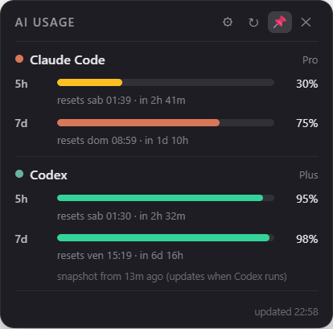
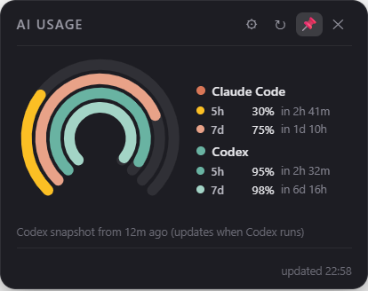

# AI Usage Widget

A small, always-on-top desktop widget for **Windows, macOS and Linux** that shows your current
**Claude Code** and **Codex** usage windows — the 5-hour and weekly rate limits — with the exact
time each window resets.

| Bars layout | Rings layout |
|---|---|
|  |  |

## Features

- **Both providers at a glance** — Claude Code (5h + weekly) and Codex (5h + weekly), each with
  percentage and a local-time reset countdown.
- **Two display styles** — stacked bars, or four concentric dashboard-style rings.
- **Fuel or usage mode** — bars/rings can show *remaining* capacity (full → drains, like a fuel
  gauge) or *used* capacity (empty → fills).
- **Warning colors** — amber when a window drops to 30% remaining, red at 10%.
- **Tray integration** — hide/show with a click; right-click for always-on-top, autostart,
  refresh, quit.
- **Resilient** — rate-limit aware (backs off and keeps showing the last good data), survives
  restarts with a persisted cache, remembers its screen position.

## How it works

| Provider | Source | Freshness |
|---|---|---|
| Claude Code | Anthropic's OAuth usage endpoint (the same data `/usage` shows in the CLI), authenticated with your existing Claude Code login | Live, polled every 3 min |
| Codex | The latest `rate_limits` snapshot in `~/.codex/sessions/**/*.jsonl` | Updates whenever Codex runs; the widget shows the snapshot age when stale |

Privacy: nothing is sent anywhere except the authenticated request to Anthropic's own API.
Codex data is read purely from local files. No telemetry, no third-party services.

### Claude credentials

The widget reuses the login you already have:

- **Windows / Linux**: reads `~/.claude/.credentials.json`.
- **macOS**: reads the `Claude Code-credentials` item from the Keychain (with file fallback).
  The first read triggers a macOS permission prompt — choose **Always Allow** so the widget can
  poll in the background.

If the access token has expired, the widget refreshes it using the same public OAuth client
Claude Code uses and writes the new token back (atomically on disk, `-U` update in the
Keychain), so Claude Code itself keeps working seamlessly. You can point the widget at a
different credentials file with the `USAGE_WIDGET_CLAUDE_CREDENTIALS` env var. Codex's
`CODEX_HOME` is honored as well.

## Requirements

- [Node.js](https://nodejs.org) ≥ 22.12 and npm
- A logged-in [Claude Code](https://claude.com/claude-code) (`claude`) for the Claude section
- A [Codex CLI / app](https://openai.com/codex) that has run at least once for the Codex section

Either section degrades gracefully (with a hint) if its provider isn't set up.

## Install & run

Clone the repository, then run:

```sh
cd usage-widget
npm install
npm start
```

The widget appears in the top-right corner of your primary display. Drag it anywhere — the
position is remembered.

### Platform notes

- **Windows**: works out of the box.
- **macOS**: works out of the box; expect the one-time Keychain prompt described above. The
  tray icon is a monochrome template image, and the app stays out of the Dock.
- **Linux**: the widget itself works everywhere, but two things depend on your desktop
  environment:
  - *Tray icon*: needs StatusNotifier/AppIndicator support. GNOME requires the
    [AppIndicator extension](https://extensions.gnome.org/extension/615/appindicator-support/);
    KDE/XFCE/Cinnamon work natively.
  - *Transparency*: most compositors are fine. If the window corners render black, launch with
    `WIDGET_OPAQUE=1 npm start` to use a solid background instead.

## Usage

- **Drag** the title bar to move the widget.
- **⚙** opens settings: bar style (Remaining/Used) and layout (Bars/Rings).
- **⟳** forces an immediate refresh (bypasses the poll throttle).
- **📌** toggles always-on-top.
- **✕** hides to the tray. Click the tray icon to bring it back.
- **Tray right-click**: Show, Always on top, Start at login, Refresh now, Quit.

### Autostart

Autostart is opt-in. Enable or disable it from the tray menu:

- **Windows**: `Run` registry key
- **macOS**: Login Items
- **Linux**: `~/.config/autostart/usage-widget.desktop` (XDG autostart)

### Configuration file

Settings (position, pin, layout, bar mode, cached usage) live in `widget-config.json` under:

- Windows: `%APPDATA%\usage-widget\`
- macOS: `~/Library/Application Support/usage-widget/`
- Linux: `~/.config/usage-widget/`

Delete it to reset the widget to defaults.

## Troubleshooting

| Symptom | Explanation / fix |
|---|---|
| Claude section says *rate-limited (429)* | Anthropic throttled the usage endpoint. The widget backs off (honoring `Retry-After`) and keeps showing the last good data with its age. It recovers on its own. |
| Claude section says *token expired* | The widget couldn't refresh your token. Open Claude Code once (any command) and the widget picks the new token up on the next poll. |
| Codex says *snapshot from Xh ago* | Codex only writes usage snapshots while it runs. Use Codex once and refresh. |
| No tray icon on Linux | See the Linux platform notes above (GNOME needs the AppIndicator extension). |
| Black corners on Linux | Start with `WIDGET_OPAQUE=1`. |
| Widget doesn't start at login | Toggle "Start at login" in the tray menu off and on. In dev mode the registered command points at `node_modules/electron`, so re-toggle after moving the project folder. |

## Development

```text
main.js              Electron main process: window, tray, IPC, autostart
preload.js           contextBridge API exposed to the renderer
src/claude.js        Anthropic OAuth usage fetch, token refresh, cache + 429 backoff
src/codex.js         Codex session-log scanner (latest rate_limits snapshot)
src/autostart.js     Cross-platform start-at-login
src/store.js         Tiny JSON config store
renderer/            Widget UI (HTML/CSS/JS, no framework)
scripts/gen-icon.js  Dependency-free PNG icon generator
scripts/install-electron.mjs  postinstall: fetches the Electron binary (works around
                     electron 42's CJS install.js vs. its ESM-only deps)
test/                Unit tests (node:test, no extra deps)
```

### Testing

```sh
npm test          # unit tests for the data modules and store
```

CI runs the suite on Ubuntu, Windows and macOS (`.github/workflows/ci.yml`).

Two env hooks make visual verification scriptable without poking at the UI:

```sh
# Render the widget, save a PNG of it, and exit:
WIDGET_SCREENSHOT=shot.png npm start

# Optionally click an element first (e.g. switch layout) before capturing:
WIDGET_SCREENSHOT=shot.png WIDGET_SHOT_CLICK='#layout-seg .seg-btn[data-layout="gauge"]' npm start
```

### Icons

`npm run gen-icon` regenerates `assets/icon.png` (color, Windows/Linux) and
`assets/trayTemplate.png` + `@2x` (monochrome macOS template images) from the raw-PNG writer in
`scripts/gen-icon.js` — no image libraries involved.

## License

[MIT](LICENSE)
